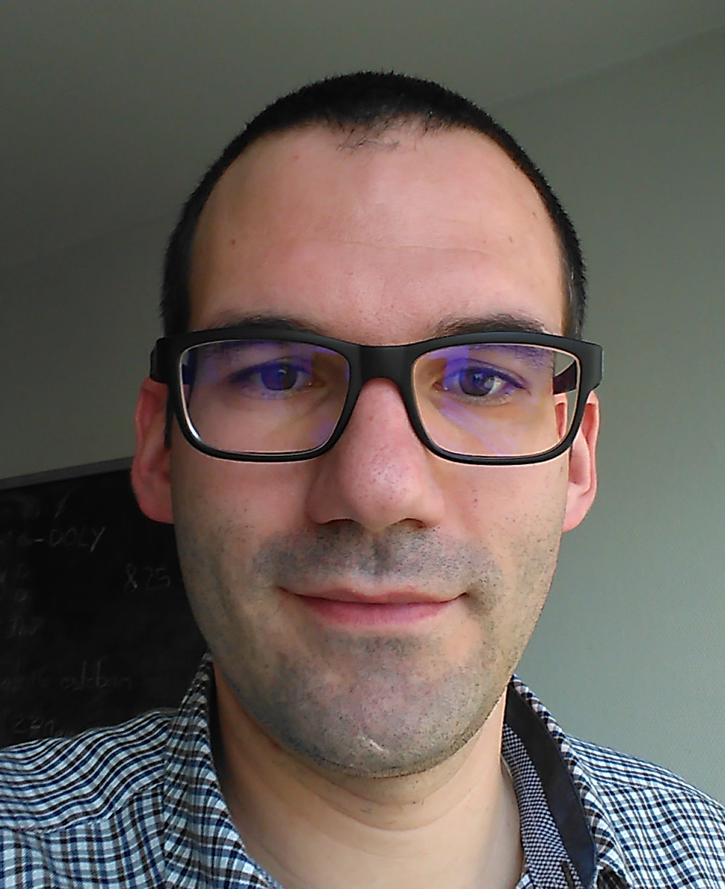

# Responsable Technique / Chef de projet technique

----

| **Nathanaël Muot PhD.**                      
| LinkedIn: *[nathanaelmuot][linkedin]*
| Twitter: *[\@NathanaelMuot][twitter]*
| GitHub: *[nmuot][github]*
| Email: *<nathanael.muot@gmail.com>*
| Phone: +33(0) 6 20 21 47 38
| Adresse: Strasbourg
| Dernière version de mon CV: *[ici][cvpdf]*
| 40 ans (1983)

----

## Résumé

Passionné par les sciences et en particulier numérique, je fais preuve d'innovation et de créativité pour répondre aux problèmes qui se posent à moi sans jamais tomber dans une forme de paresse intellectuelle. J'ai un tempérament de leader naturel cherchant toujours à tirer l'équipe pour relever les défis qui s'offrent à nous. J'ai un esprit pragmatique, recherchant la simplicité et je possède une forte capacité d'analyse me permettant d'intervenir sur un large spectre de champ d'applications.

Depuis plus de 15 ans, je mets mes talents au service de la modélisation numérique prédictive. Dans ce cadre, je suis le principal référent technique concernant le développement logiciel en mathématiques appliquées et physiques. Je suis également en charge de la 'qualité logicielle' dans la poursuite de l'amélioration continue, mais également et surtout en apportant de la valeur ajoutée pour les clients.

Applied mathematics, Adaptability, Creative Thinking, Leadership, Digital, Dyslexic Advantage...

## Compétences

- Leadership naturel, solide compétence en conduite de projets complexes et innovants, animation d'équipe pluridisciplinaire.
- Maîtrise des techniques développement logiciels ; Software Quality Assurance, Agile software development, DevOps, Continuous Integration, Continuous Delivery.
- Larges compétences mathématiques : Algorithmie, High-performance computing (HPC), Calcul numérique, Systèmes dynamiques, Systèmes discrets, Systèmes hybrides, Traitement du signal, Optimisation, Maillage et Géométrie.
- Développement de logiciel à haute valeur scientifique (C, C++, Python, Fortran et Binding) sur architecture haute performance Linux et Windows.
- Grande agilité en physique Équations de Maxwell, lignes de transmission, Théorie des Circuits, Électronique, Télécommunication.
- Large maîtrise de bibliothèque scientifique Jupyter, HDF5(tables), NumPy, SciPy, Pandas, SimPy, matplotlib, boost, VTK, GLM (OpenGL Mathematics), ØMQ, MPI, OpenMP, OpenCL, ...
- Emacs, VS Code, Git, gdb, Valgrind, CMake, Markdown, Latex, ReST(Sphinx), LibreOffice, Ms Office
- Anglais lu et parlé

## Expériences

2019-aujourd'hui
: **Operation & Software Quality Assurance (SQA) Manager** à *[AxesSim][axs]* 

	Garantir le bon déroulement et l'exécution des projets. Gestion de la production (développement et études). Pérenniser l'activité sur le long terme (satisfaction du client, besoins du client, vision globale du produit). Budgétisation et gestion. Stratégie à long terme.

2017-aujourd'hui
:   **Software Quality Assurance (SQA) Manager.** à *[AxesSim][axs]* 

    Dans le cadre de cette activité, j'ai la responsabilité de définir et de mettre en place le processus permettant d'améliorer les solutions logicielles d'AxesSim, en intégrant mieux les besoins clients en adéquation avec les objectifs et les ressources disponibles.

2015-aujourd'hui
:   **Responsable technique et animateur de l'équipe numérique (scrum master).** à *[AxesSim][axs]*

    En tant que responsable technique et animateur du développement des méthodes numériques (mathématiques appliquées, physiques, géométrie et maillage), je joue un rôle d'expert technique en support à la direction. J'ai également pour responsabilité de définir la feuille de route et sa mise en oeuvre en accord avec la direction.

2014-aujourd'hui
:   **Responsable technique de projets R&D collaboratifs.** à *[AxesSim][axs]*

    En qualité de représentant technique sur plusieurs projets de recherche et développement nationaux mixtes (industriel et académique), duals (civil et militaire) en partenariat avec plusieurs laboratoires de recherche et grands comptes de l'aéronautique, de la défense et du spatial, j'ai pour mission de m'assurer de la faisabilité des engagements pris, du respect des délais de livraison, de la maîtrise des coûts, du suivi technique des sous-traitances, de la communication technique interne et de la dissémination.

<!--
    * SAM
    * ANALYST
    * Le projet [Conforme 2][17-20_conforme2] est une montée en TRL du projet [Conforme][13-16_conforme] ; d'une part pour lever les derniers verrous techniques et d'autre part de généraliser l'approche pour répondre aux besoins d'industrialisation. En partenariat avec XLim et Dassault Aviation.
    * Le projet [HOROCH][15-18_horoch] (Utilisation des HPC pour l’Optimisation des Radiocommunications des Objets Connectés proches de l’Homme) vise à l'utilisation d'une méthode de Galerkin Discontinus sur architecture massivement parallèle pour la modélisation de l'intéraction onde corps humain. En partenariat avec THALES Communications & Security, Cityzen Sciences, ONERA, IRMA, BodyCap.
    * Le projet [Conforme][13-16_conforme] est un projet de R&D amont permettant une meilleure prise en compte de faisceau de câbles proche des parois pour la CEM en partenariat avec XLim et Dassault Aviation.
    * Le projet [GREAT][12-14_great] est un transfert technologique public (ONERA, IRMA) / privé, visant à implémenter un solveur électromagnétique 3D dans le domaine temporel basé sur la méthode de Galerkin Discontinus sur architecture GPU.
-->

2010-aujourd'hui
:   **Ingénieur logiciel scientifique** à *[AxesSim][axs]*

    J'ai pour mission de concevoir, développer et maintenir plusieurs briques logiciels à haute valeur scientifique et technique.
    
    - coeur de calcul pour la modélisation des faisceaux de câbles ligne de transmission (MTLN, FDTD, BLT, Modified Nodal Analysis, State Variable) pour la modélisation des interférences électromagnétiques, de la compatibilité et de l'intégrité du signal.
    - stratégie d'hybridation de méthodes numériques.
    - moteur de maillage dédié à la génération de maillage dit structuré pour les méthodes des différences finies.

2010-2013
:   **Doctorat en mathématiques appliquées et physiques** à *[ONERA][onera]* et *[AxesSim][axs]*

    Réalisation dans le cadre d'une bourse CIFRE de l'ANRT d'une Thèse qui poursuit aussi un but industriel. En plus d'apporter des solutions pour prendre en compte toute la complexité des faisceaux de câbles, cette thèse avait également pour but de préparer une industrialisation efficace de solutions d'hybridation forte.

## Speaker

2018
: **[BIZZ&BUZZ Digital_Festival sur la thématique Mathématiques de l'innovation][2018mathinnov]**

2017 
: **[Invité à la 5ème Journée MésoChallenge][2017mesochallenge]**

2015 
: **[Invité à la 19ème rencontre Math Industrie][2015mathindus]**

    HPC dans les entreprises et l’industrie : des outils mathématiques pour tirer profit des nouvelles capacités de calcul scientifique.

## Formations

2010-2013
:   **Doctorat de physiques et mathématiques appliquées** à *[Institut Supérieur de l’Aéronautique et de l’Espace (ISAE)][isae]*

    Titre : [Stratégies d'hybridation de méthodes de simulation électromagnétique FDTD/MTL - Application à l'étude de grands systèmes complexes -][these]

2005-2009
:   **Ingénieur Télécom** à *[IMT Atlantique (anciennement TELECOM Bretagne)][imt]*

    Option : STI, Systèmes de Traitement de l'Information Spécialisation : ACTIF, ACquisition et Traitement de l’InFormation

2008-2009
:   **Master recherche SISEA** à *[IMT Atlantique (anciennement TELECOM Bretagne)][imt]*

    SISEA (Signal, Image, Systèmes Embarqués, Automatique). Option Image

2003-2005
:   **Cycle préparatoire CPGE Option TSI** au *Lycée Monge*

2003
:    **Degree** *Concours général des lycées en génie électronique*

1999-2003
:   **Cycle secondaire** *lycée Briffaut*

    BAC-STI et BEP génie électronique

## Loisirs et activités extraprofessionnels

Jardinage
: Le Jardinage d'intérieur ou d'extérieur (potager) est pour moi un moment propice à la méditation qui forme à la patience et la persévérance pour obtenir le résultat désiré. Et non des moindres, il permet d'accommoder notre assiette de fruits et légumes murs.

Sport
: Ski, surf, inconditionnel de sport de glisse d'hiver. En bon citadin, je trouve au vélo une alternative agréable au transport plus traditionnel. Je complète cette activité par un peu de natation.

Animalerie
: Sans être un mordu, j'aime passer un peu de temps au bord de l'eau à pêcher.

[cvpdf]: https://github.com/nmuot/curriculum/raw/master/cv_nmuot.pdf
[linkedin]: https://linkedin.com/in/nathanaelmuot
[twitter]: https://twitter.com/NathanaelMuot
[github]: https://github.com/nmuot
[axs]: http://www.axessim.eu/
[these]: http://tel.archives-ouvertes.fr/tel-00841708/
[onera]: http://www.onera.fr/en/demr
[imt]: http://www.imt-atlantique.fr/
[isae]: https://www.isae-supaero.fr/en/

[2018mathinnov]: http://bizzandbuzz.alsace/sessions/mathematiques-de-linnovation/
[2015mathindus]: http://smai.emath.fr/spip.php?article554&amp;amp;amp;amp;amp;amp;amp;amp;amp;amp;lang=fr
[2017mesochallenge]: https://www.calmip.univ-toulouse.fr/spip.php?article559

[17-20_conforme2]: https://www.axessim.fr/projects
[15-18_horoch]: https://www.axessim.fr/projects
[13-16_conforme]: http://www.agence-nationale-recherche.fr/Projet-ANR-12-ASTR-0042
[12-14_great]: https://www.axessim.fr/projects
